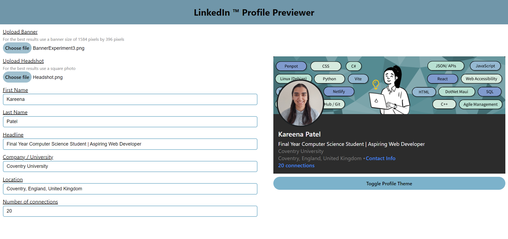

# LinkedIn Profile Previewer

## ⌨️ Technology + Assets stack
HTML / SASS + SCSS / React / Vite / npm / Node.js / Netlify 

## 🍼 Introduction
When experimenting or changing banners on LinkedIn, I don't think there is a way to preview the profile with the changes unless the changes are physically accepted. Therefore I created the LinkedIn Profile Previewer. The web application enables users to produce a replication of their LinkedIn profile header. This gives users the opportunity to test different headshots and banner designs before applying the changes to their actual LinkedIn profile.

## 🛠️ Features
- Users can choose headshot and banners they want to view on the profile mockup.
- Users can enter simple LinkedIn information to replicate their profile 
- Toggle between light and dark mode on the profile card 
- Web application is accessible on mobile and desktop

## 📚 Resources
- Scrimba's Learn React - https://scrimba.com/learn/learnreact
- ByteGrad's Sass tutorial using npm and Node.js - https://www.youtube.com/watch?v=ztEY-uber4U
- DesignCourse's (Gary Simon) SASS tutorial - https://www.youtube.com/watch?v=roywYSEPSvc

## ➕ Potential Features to add 
- Toggle between light and dark mode on the whole web app
- Popovers to provide additional information - toggle to show/hide